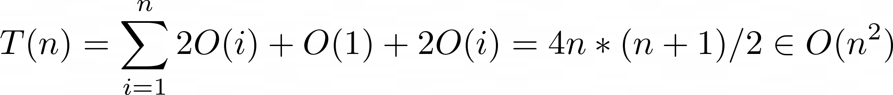

# Question 3 (Theory)

## Stack Definition
```py
Stack 
    methods:
    push()
    pop()

    fields:
    top
    length

```
## An idea for sorting stacks 

```py
plain_stupid_stack_sort_algorithm(stack)

    n = stack.length
    A : int array of length (n)

    # convert stack to array
    for i = 0 to n
        A[i] = stack.pop()

    # sort!
    merge_sort(A)

    # convert array back to stack
    for i = 0 to n
        stack.push(A[i])    

```
### time: O(n logn)
covnerting stack back and forth to array takes O(n) time,
and merge-sorting arrays takes O(nlogn), therefore total time spent is O(nlogn).
### memory: O(n)
array of length n takes O(n) space and variable n takes O(1) memory.


## Another idea

```py
sort(stack : Stack)

    help, sorted: Stack

    while stack.length > 0
        x = stack.pop()
       
        if sorted.length = 0
            sorted.push(x)
            continue
        
        while x < sorted.top and sorted.length > 0
            help.push(sorted.pop())

        sorted.push(x)

        while help.length > 0
            sorted.push(help.pop())

    return sorted
```

### Proof
we're making sure the x is placed so that if's bigger/equal than it's lower items and smaller than it's topper values. then the sorted array is always sorted (with the max at the top).

### Best case scenario
if the input stack is itself sorted (with its min at the top), the algorithm only takes O(n) time, since all it will be doing is popping from it and pushing to a new stack.

### Worst case scenario
if the input stack is sorted with its max at the top, for every value we will be popping all items in the sorted and pushing it to the end and pushing items back. so the time complexity will be:



---
Aeirya Mohammadi -
97103779