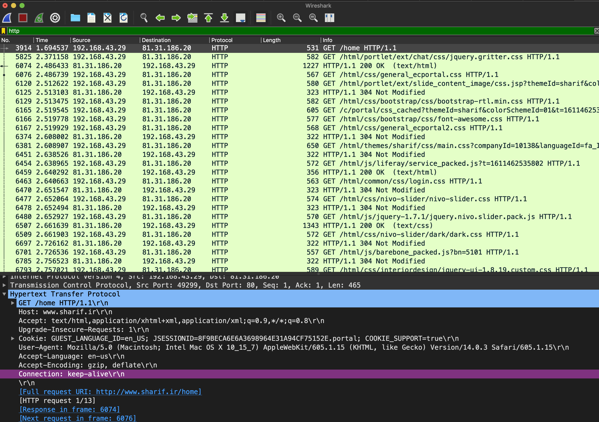
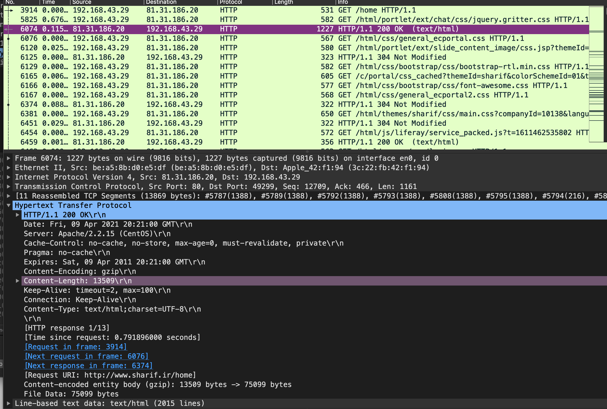
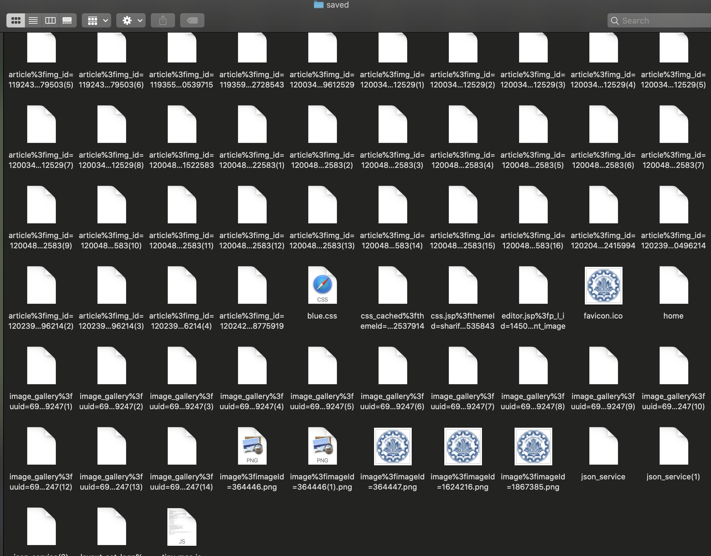
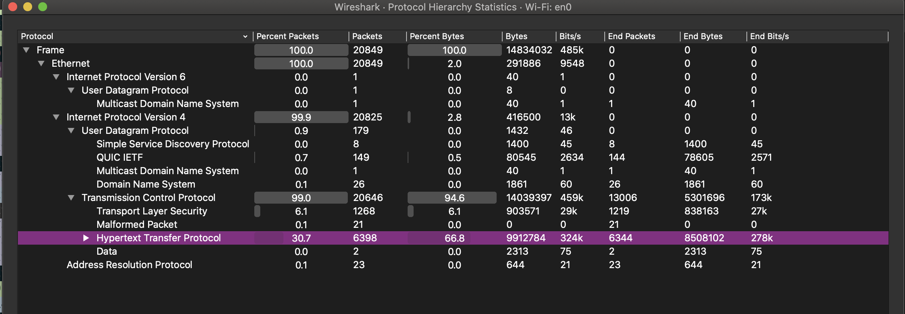
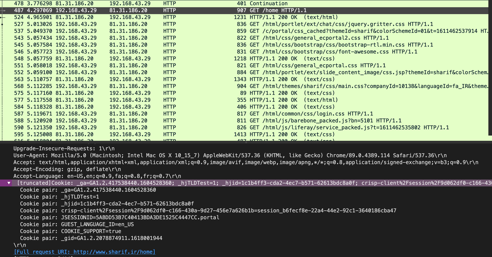

# wireshark  تمرین تحویلی 

## 1. http version
هر دو 
http 1.1

## 2. ip
ما
192.168.43.29

سرور
83.31.186.20

## 3. status code
200 OK

## 4. accept language
en-us

## 5. content length
13509

## 6. objects

## 7. delta time
2.4864 - 1.6945 = 0.7919

## 8. protocol statistics
30.7 %

## 9. 
بله صریح اند.
در غیر این صورت باید برای دریافت بعضی از محتواها مجبور به تغییر مسیر و درخواست به آدرس‌های متفاوت از آدرس درخواست می‌بودیم
.

## 10. persistence
persistant (keep-alive)

(اشاره به عکس اول)

در این حالت تنها یک بار نیاز به باز کردن ارتباط تی‌سی‌پی می‌باشد
و کانکشن برای درخواست‌های بعدی باز می‌ماند.

اما در حالت غیر ماندگار برای هر درخواست یک ارتباط جدید باید برقرار شود
.

## 11. cookie
کوکی‌ها علاوه بر این که خوشمزه  هستند کمک می‌کنند تا 
سرور بتواند از کلاینت خود وضعیت نگهداری کند. 
کوکی‌هایی که مشاهده می‌کنم یا شناسه کاربر است٫ یا زبان کاربر٫ و یا کوکی مربوط به گوگل انالیتیکس و یا حتی همین مسئله که می‌شود کوکی نگه‌داشت یا نه! دیگر کوکی‌ها هم نمی‌دانم

---
Aeirya Mohammadi

97103779